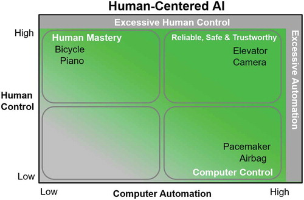
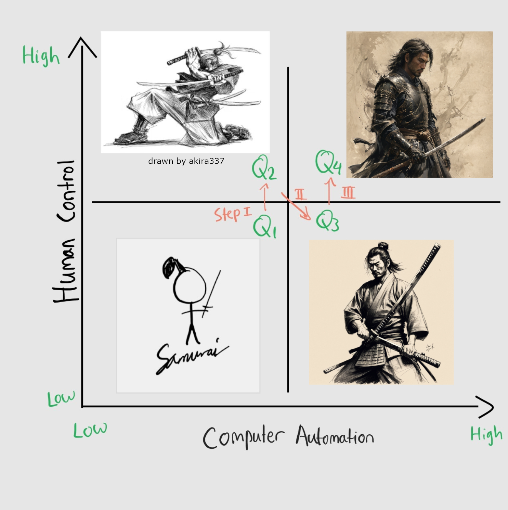

Over the past two weeks, I’ve been diving into the world of generative AI (GenAI) for creating images. This journey has been both personal and professional, connecting to my past in unexpected ways. Back in high school, I ran a print-on-demand business designing varsity jackets for my cohort. While the business was successful, I struggled to create original designs. Coming up with something unique—especially complex illustrations—was time-consuming and frustrating.

Fast forward to today, I’ve realized how GenAI could have been a game-changer for that process. Tools like Stable Diffusion could have helped me brainstorm ideas, refine designs, and experiment with creative variations effortlessly.

As someone deeply embedded in research on human-AI collaboration, this exploration has also been reflective. My perspective is shaped by [Ben Shneiderman’s Human-Centered AI (HCAI) framework](https://www.tandfonline.com/doi/full/10.1080/10447318.2020.1741118?scroll=top&needAccess=true) (or [free access here](https://arxiv.org/pdf/2002.04087)), which emphasises balancing human control and computer automation (AI) for optimal outcomes. I built on this framework for my PhD work, presenting my own adaptation -- [SLADE](https://rioalfredo.com/pdfs/lak24-slade.pdf) -- at the Learning Analytics and Knowledge Conference in 2024 (LAK24). Revisiting these ideas through my experience with GenAI has given me new insights into how humans and AI can collaborate creatively.

Let me take you through this journey using the HCAI-inspired quadrant model, which categorises human-AI collaboration along two axes: **human control** and **computer automation**.

<quote> Figure 1. Ben Shneiderman's HCAI two-dimensional framework</quote>

## ◳ The Four Quadrants of Human-AI Collaboration in Generative Art

### **Q1: Low Human Control, Low Computer Automation**

This quadrant represents traditional art creation—manual and unaided. Imagine sitting down with a pencil or using basic digital tools like MS Paint to create simple sketches or stick figures. There’s no AI involved here; it’s just raw human creativity.

For me, this is where it all began -- experimenting with simple sketches to visualise ideas without computational assistance. It’s a great starting point for developing creative confidence.

**Tools**: Pencil, paper, or basic drawing apps like MS Paint.

### **Q2: High Human Control, Low Computer Automation**

In Q2, skilled artists use advanced tools like Photoshop or Procreate without any computer automation involvement. The emphasis here is entirely on human expertise and creativity.

While I don’t consider myself an expert artist, I’ve always admired how professionals bring their visions to life through skill alone. Their work reminds us of the value of craftsmanship in an increasingly automated world. Please support them! 👏

**Tools:** Adobe Photoshop, Illustrator, Procreate, GIMP, Clip Studio Paint.

### **Q3: Low Human Control, High Computer Automation**

This is where most people first encounter text-to-image GenAI tools in **ChatGPT Image Creator** or **Bing Image Creator**. In this stage, users input a simple prompt and let the AI generate results. While these tools are powerful and can quickly produce impressive images, they often result in generic outputs that may not fully align with the user’s vision -- a phenomenon known as concept bleeding. Users typically resort to trial and error, tweaking prompts and generating multiple images to find one that closely matches their desired outcome.

This was my initial experience with generative art. Typing prompts like “a samurai holding a katana” felt magical as the system generated detailed images in seconds. However, I often encountered issues like extra fingers, incorrect poses, or unintended color blending. To achieve the desired results, I had to generate numerous images and refine my prompts extensively (until it looks like a whole chunk of paragraph). Through further research on each tool’s capabilities, I discovered various parameters and best practices for writing prompts, which led me to transition to Q4.

**Tools**: ChatGPT Image Creator, Bing Image Creator, Midjourney, DALL-E, Nightcafe.

### **Q4: High Human Control, High AI Automation**

The final quadrant represents true collaboration between human creativity and AI capabilities. Here, users actively guide the process by fine-tuning parameters and making manual adjustments to achieve highly customised results.

Recently, I have focused my efforts on this collaborative approach. With limited hand-drawing skills, I’ve learned about different models/checkpoints, prompt best practices, and parameter tweaking. I use [Stable Diffusion’s AUTOMATIC1111 interface](https://github.com/AUTOMATIC1111/stable-diffusion-webui), offering a robust platform for creative exploration.

My current favourite is the Juggernaut model, and I follow this prompting guide [https://learn.rundiffusion.com/prompting-guide-for-juggernaut-x/](https://learn.rundiffusion.com/prompting-guide-for-juggernaut-x/). Additionally, I’ve discovered that incorporating LoRAs can adjust styles and subjects within the images effectively. Key parameters I utilise include **sampling steps**, **CFG scales**, and the **inPainting** feature, along with extensions like **ControlNet** and **Regional Prompter**.

Here is my favourite setting:
Sampling Method: DPM++ 2M SDE Karras
Sampling Steps: 30-40
CFG Scale: 3-6 (less is a bit more realistic)

I am currently advancing it further by using [ComfyUI](https://github.com/comfyanonymous/ComfyUI), which offers a node-based interface giving more control. It is slightly more complex but enjoyable to learn. Additionally, I always apply final touches in GIMP (similar to Adobe Photoshop) to enhance art that I really like. Collaborating with GenAI at this level has allowed me to create designs that feel uniquely mine while leveraging the power of AI.

**Tools:** Stable Diffusion (with AUTOMATIC1111 Web UI or ComfyUI), ControlNet for precise control over image composition, LoRAs for custom styles or subjects.

Figure 2. A map of generative art steps in HCAI two-dimensional framework. Q1 is simple stick figure of a samura, Q2 is a proper sketch of a samurai by [akira337 from DeviantArt](https://www.deviantart.com/akira337/art/Samurai-1-118361713), Q3 is a simple prompt "a samurai holding a katana sketch" in Stable Diffusion, and Q4 using the same prompt with additional parameters tweaking and a LoRA by [HailoKnight](https://civitai.com/models/312766/soul-knight-by-hailoknight?modelVersionId=350951).

## 🤔 Lessons Learned: Moving From Q3 to Q4

Transitioning from Q3 (letting AI do most of the work) to Q4 (collaborating with AI) has been a steep but rewarding learning curve. Unsurprisingly, in Instagram, artists who engage deeply in Q4 often produce more personalised results that resonate better with audiences -- whether it’s through refining prompts or touching up outputs in Photoshop or Procreate.

Here are some key concepts I’ve picked up along the way:

- Model Checkpoints: These are foundational neural networks pre-trained on large datasets to generate images from text prompts. They serve as the starting point for customisation and fine-tuning, enabling the creation of diverse and high-quality images by capturing the model’s learned parameters at specific training stages. You can explore and download them here [https://civitai.com/](https://civitai.com/) and [https://huggingface.co/](https://huggingface.co/models?pipeline_tag=text-to-image&sort=trending)
- **Sampling Steps:** These determine how many iterations the AI performs to refine an image. More steps often mean better quality but take longer. [https://stable-diffusion-art.com/samplers/](https://stable-diffusion-art.com/samplers/)
- **CFG Scale:** This controls how closely the output adheres to your prompt. A higher scale results in stricter adherence; a lower scale allows for more creative interpretation (let the AI model that you use decides).
- **ControlNet:** A tool that lets you guide the composition by providing outlines or sketches for the AI to follow. [https://stable-diffusion-art.com/controlnet/](https://stable-diffusion-art.com/controlnet/)
- **Regional Prompter:** Enables you to describe different parts of an image separately (e.g., “a sunny sky” in one area and “a dark forest” in another). [https://stable-diffusion-art.com/regional-prompter/](https://stable-diffusion-art.com/regional-prompter/)
- **LoRAs (Low-Rank Adaptation Models):** Custom add-ons that teach the AI specific styles or subjects based on additional training data. You can download them here [https://civitai.com/](https://civitai.com/)

## 👍 My Recommendations for Beginners

If you’re interested in exploring generative art and moving toward Q4-level mastery, here’s where you can start:

1. **Experiment with user-friendly platforms:** Begin with Midjourney or DALL-E to understand basic prompting. You can visit Nightcafe where everyone is super friendly, and it is mostly free.
2. **Learn prompt engineering:** Practice crafting detailed prompts that yield better results.
3. **Set up Stable Diffusion:** Install AUTOMATIC1111’s Web UI—it’s beginner-friendly yet powerful. Here is the website:
4. **Explore advanced features:** Experiment with sampling steps and CFG scales to see how they affect outputs. I recommend use `Script` option at the bottom, and select X/Y/Z plot to produce multiple images with different parameters tweaking.
5. **Try ControlNet:** Use it to guide compositions by providing sketches or outlines.
6. **Leverage LoRAs:** These are great for achieving specific artistic styles. Include them in the prompt, and adjust the weight. You can explore and learn how to use it: https://civitai.com/
7. **Join communities:** Platforms like Reddit’s r/StableDiffusion or Discord servers dedicated to generative art are invaluable for learning tips and sharing your creations.

Figure 3. X/Y/Z plot example of different sampling steps and CFG scales.

## 📈 My Final Thoughts: Rethinking GenAI in Education

For artists concerned about AI-generated art, it’s important to recognise the craftsmanship involved in parameter tweaking and tool selection. These processes require creativity and skill, allowing artists to guide AI in producing unique, consistent, and personalised works. Rather than replacing traditional artistry, I believe AI can complement and expand creative possibilities.

Reflecting on this journey has deepened my understanding of how humans and machines can collaborate creatively -- not just in art but across learning environments. As a researcher in learning analytics and software engineering educator, I notice current educational discourse around GenAI remains narrow 😳 -- focused mainly on text-based tools like ChatGPT as solutions for automating tasks (like generating codes) or addressing cheating concerns. I am sharing the same view with this research article: https://www.nature.com/articles/s41562-024-02004-5 or https://arxiv.org/pdf/2408.12143.

Take the image generation journey I've just described, tools and practices in Q4 could help students in:

- Write a complex prompt about a concept, such as "microservices architecture for an e-commerce platform”, receive a visual diagram (i.e., UML) that they can critique or refine further (with better prompts).
- Develop multimedia storytelling skills, where students could use text-to-image tools to generate visuals for technical presentations or even create AI-generated videos to explain concepts like DevOps pipelines or version control workflows.
- Generate mockups for user interfaces based on textual descriptions, which can spark rich classroom discussions by rapidly producing multiple prototype UI/UX design samples. This approach encourages students to critically analyse design variations, compare different interpretations of the same requirements, and develop a more nuanced understanding of UI design principles.
- and many more

These examples highlight how GenAI can go beyond automating tasks to become a collaborative partner in the learning process. By integrating these tools thoughtfully, educators can help students develop not only technical skills but also critical thinking and creativity -- qualities essential for modern software engineers.

As we continue exploring these technologies, it’s important to move beyond narrow questions like, “How do we address students using ChatGPT for writing essays or code?” Instead, we should ask, “How can other forms of AI, such as text-to-image, video generation, or multimodal tools, enhance learning for both students and educators?” The HCAI-inspired quadrant framework serves as a metaphor for thoughtfully integrating AI into education while preserving human agency, extending beyond traditional text-based assessments like essays, documentation, or reflections.

While more research is needed to address technical barriers, skill gaps, assessment validity, academic integrity, and ethical considerations, I firmly believe that GenAI has transformative potential when used responsibly. It’s time for educators and researchers to broaden their focus beyond text-based GenAI and embrace the diverse possibilities these tools offer to transform learning experiences. What do you think? 😊
