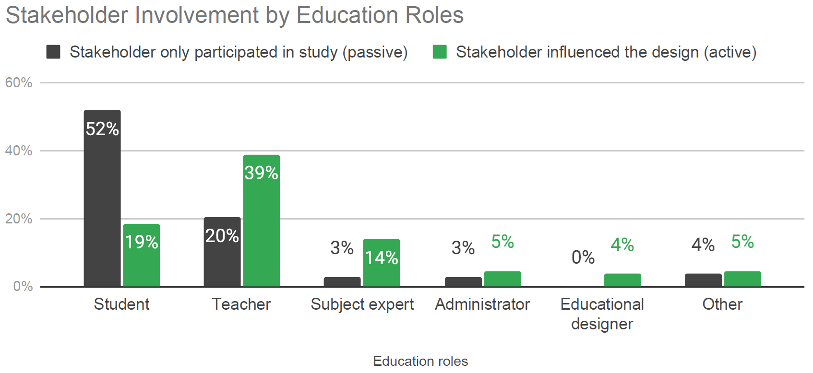
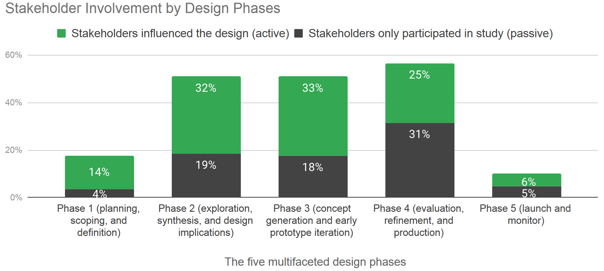
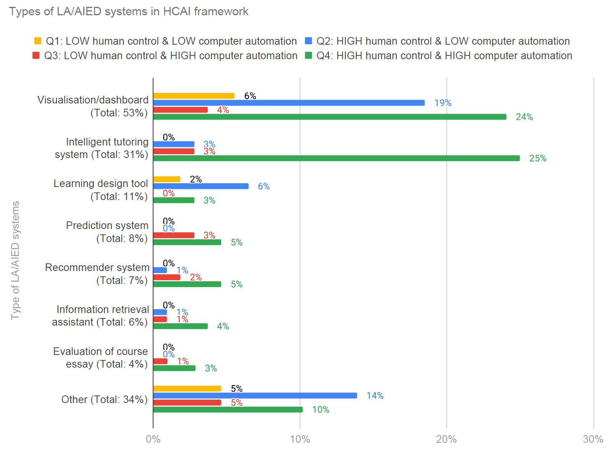
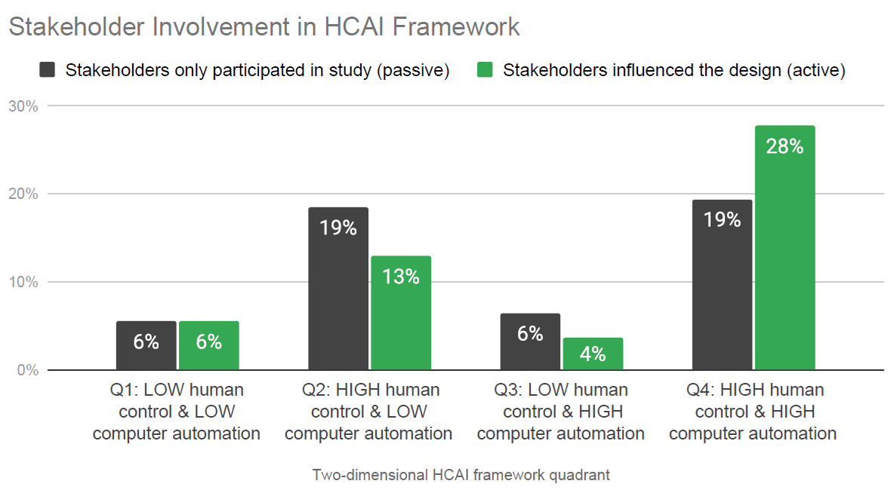

## The Human Touch in AI-Powered Education: What We've Learned

As a researcher in the field of human-centered learning analytics (HCLA) and AI in education (AIED), I've been fascinated by how these technologies are reshaping our educational landscape. Recently, my colleagues and I conducted a systematic literature review to understand the current state of human-centered approaches in this rapidly evolving field. I'd like to share some key insights from our study that I believe are crucial for educators, researchers, and anyone interested in the future of education.

## The Promise and Perils We're Facing

In our review, we saw how AI and learning analytics are opening up exciting possibilities for personalized learning and data-driven decision-making in education. However, we also encountered growing concerns about data privacy, algorithmic bias, and the potential loss of human agency. These concerns have led to an increased interest in human-centered design approaches.

## Finding the Sweet Spot: Human Control vs. Automation

One of the most interesting aspects of our study was examining how different LA/AIED systems balance human control and computer automation. We found that many systems tend to fall into one of four categories:

- Q1: Basic information delivery systems (low control, low automation)
- Q2: Customizable dashboards and educator-driven analytics (high control, low automation)
- Q3: Fully automated feedback and recommendation systems (low control, high automation)
- Q4: AI-assisted tools that empower users while leveraging advanced algorithms (high control, high automation)

Interestingly, we noticed that many current systems focus on either high human control or high automation, but fewer strike a balance between the two. This suggests an opportunity for future development in creating more balanced systems.

## The Missing Voices: A Stakeholder Gap

One of our most concerning findings was the limited involvement of end-users, especially students, in the design process of LA/AIED systems. While there's growing recognition of the importance of stakeholder input, we found that actual implementation of co-design practices remains limited. This is a critical area for improvement if we want to create systems that truly meet the needs of learners and educators.

## Safety, Reliability, and Trust: Areas Needing Attention

Our review highlighted that issues of safety, reliability, and trustworthiness in LA/AIED systems are often overlooked in current research. As these technologies become more prevalent in education, addressing these concerns will be crucial for widespread adoption and ethical implementation.
Moving Forward: Our Recommendations
Based on our findings, we've developed several recommendations for future work in this field:

- Increase stakeholder involvement throughout all design phases, from initial conception to deployment and evaluation.
- Actively engage target end-users, particularly students, in determining the balance between human control and automation.
- Prioritize safety, reliability, and trustworthiness as core principles in the development of LA/AIED systems.

## What's next?

As we continue to explore the potential of AI and learning analytics in education, I believe keeping the human element at the center of our designs is more important than ever. By involving educators and learners in the process, we can create technologies that truly enhance the learning experience while respecting human agency and ethical concerns.

I hope these insights from our research serve as a valuable roadmap for anyone interested in the intersection of AI, learning analytics, and human-centered design in education. Let's work together to create educational technologies that empower rather than replace, augment rather than automate, and ultimately serve the diverse needs of learners and educators alike 🙌.

> Alfredo, R., Echeverria, V., Jin, Y., Yan, L., Swiecki, Z., Gašević, D., & Martinez-Maldonado, R. (2024). Human-centred learning analytics and AI in education: A systematic literature review. Computers and Education: Artificial Intelligence, 6, 100215. https://doi.org/10.1016/j.caeai.2024.100215
