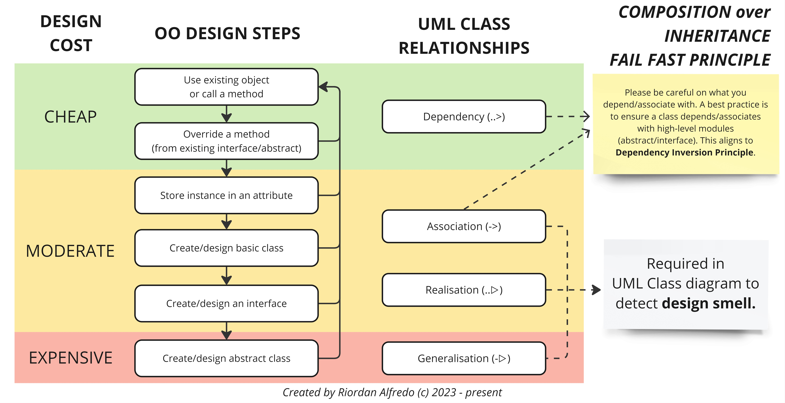
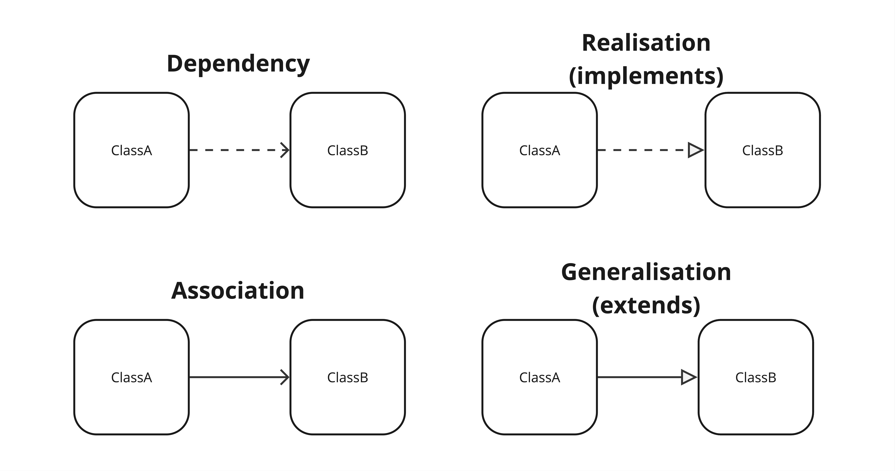

# 🚂 LOCO-MOTIVE: Legacy-Oriented COde MOdernisation through Valuable Iterative Enhancements

Over the years, while teaching and diving into various Object-Oriented (OO) projects with Java, I've noticed something pretty interesting: there’s often a big gap between what we learn in theory and how we actually use those concepts in the real world. One of the trickiest challenges? Working with code that we can’t touch—like those frameworks and libraries that come with their own quirks. We often end up dealing with what we call “legacy code.”

To tackle this challenge, I’ve come up with an approach I like to call _LOCO-MOTIVE: Legacy-Oriented COde MOdernisation through Valuable Iterative Enhancements_. This approach is all about bridging that gap between OO theory and practical implementation. It’s especially handy when you’re wrestling with legacy codebases or trying to integrate new libraries—scenarios you’re definitely going to face in your future jobs or even in your advanced uni projects. So, what’s the deal with LOCO-MOTIVE? Let’s jump into this approach and see how it can level up your OO design skills. Enjoy 🙌!

## Prerequisites

Before we dive in, it's worth mentioning that while knowledge of the following concepts is helpful, I'll do my best to explain everything in accessible terms:

- 4 pillars of OOP: encapsulation, inheritance, polymorphism, abstraction
- DRY: Don't Repeat Yourself
- SOLID principles
- Composition over Inheritance
- Fail-fast principle

## Challenge: The DRY Principle Pitfall

First, let me address a common misconception I've observed among my students. The DRY (Don't Repeat Yourself) principle, while valuable, can be a bit of a trap for new OO programmers. I've seen many eager learners rush to create abstract classes at the first sign of code duplication. While their intentions are good, this often leads to premature abstraction and overly complex hierarchies. Instead, I encourage you to consider composition or targeted refactoring before jumping into inheritance-based solutions.

## Proposed Solution: LOCO-MOTIVE

To address this challenge, I've developed an approach called LOCO-MOTIVE: Legacy-Oriented COde MOdernisation through Valuable Iterative Enhancements. This approach is divided into three key areas:

1. **Design Expenses**: Understanding the cost implications of design decisions.
2. **Six Design Steps**: A structured approach to work with legacy code.
3. **UML Class Relationships**: Utilising visual representations to identify and prevent design smells.
   Let's dive in:

### 1. Design expenses

In my approach to OO design, I categorise design decisions into three cost levels:

1. **Cheap**: These are the most straightforward and least risky design choices. They involve using and reusing existing methods, which aligns with the principle of adhering to established contracts when using frameworks or libraries. This approach is easy to maintain and promotes low coupling
2. **Moderate**: This level involves creating our own classes when existing features don't meet our needs. It's a step up in complexity but allows for customisation. Storing instances as attributes also falls into this category, as it can introduce potential issues with privacy leaks and object mutability
3. **Expensive**: These are the most complex and potentially risky design decisions. Creating abstract classes falls into this category because it combines abstraction and logic in one place, which can lead to tighter coupling and more complex hierarchies. This usually leads to several code smells, such as `shotgun surgery`.

## 2. Six Design Steps

Now, let me walk you through the six steps of my OO design process:

1. **Use and re-use methods**: Always check if there's an existing method you can use. Why reinvent the wheel, right? For instance, use Java's `Collections.sort()` instead of writing your own sorting algorithm.
2. **Extend/implement method, then override it**: Sometimes, you need to tweak existing behaviour. Just be careful not to break the contract. A classic example is overriding `toString()` in your custom class.
3. **Store instance as an attribute**: This can be trickier than it looks due to privacy leaks and object mutability. Remember when we talked about storing Date objects in class? That's where defensive copying comes in handy.
4. **Create/design class**: This is where you get to flex your creative muscles. You might need to create a custom `Logger` class that fits your specific project requirements.
5. **Create/design interface**: This is where we put "Composition over Inheritance" into practice. Think about defining a `PaymentProcessor` interface for various payment methods.
6. **Create/design abstract class and extend from it**: Please use this sparingly. It can lead to complex hierarchies and tight coupling (e.g., parent's class call). But it has its place, like an abstract `Shape` class for `Circle` and `Rectangle` subclasses.

Crucially, this process is iterative. After completing each step, we circle back to the first step to reassess our design. This iterative approach ensures that we:

1. Continuously evaluate the effectiveness of the solution.
2. Avoid unnecessary complexity by always considering simpler options first.
3. Align with the "Fail Fast" principle by identifying issues early in the design process.

For example, after creating a new class (step 4), we return to step 1 to see if we can now use or reuse methods from existing classes, including the newly created one, before considering more complex solutions. This iterative cycle continues through each step, always starting back at the simplest option. This stepwise, iterative approach encourages careful consideration before implementing more complex solutions, aligning with the "Composition over Inheritance" principle. It also helps us maintain flexibility in our design, allowing us to adapt to changing requirements or new insights as we work with legacy code that we cannot directly modify. By consistently revisiting simpler options, we ensure that we're not unnecessarily complicating our design when interacting with existing systems.

By following this cyclical process, we ensure that each design decision is thoroughly evaluated and that we're not unnecessarily escalating the complexity of our solution. I reckon this approach is particularly valuable when working with legacy systems, where incremental improvements are often more practical and less risky than wholesale rewrites.

### 3. The Value of UML Class Diagrams

Now, I know some of you might think UML diagrams are a waste of time, but trust me, they're incredibly useful for quickly expressing design ideas. I prefer sketching them by hand - it's faster and helps identify design smells early on. This aligns nicely with the Fail Fast principle we've discussed. The four basic UML class diagram relationships I find most useful are these four relationships: dependency, association, generalisation (extends), and realisation (implements).

Pay special attention to association, implementation, and generalisation relationships. They're brilliant for spotting high-level design smells. Remember, these relationships essentially represent dependencies, which is why I often consider dependency lines optional in my sketches on UML class diagrams.

## Limitations

While the **LOCO-MOTIVE** approach has proven to be a valuable framework for working with legacy code and external libraries in my projects and with my students, it's good to keep in mind a few points that can help you maximise its effectiveness. First off, this approach is based on my personal experiences rather than rigorous scientific research. This means it's adaptable and can evolve as you encounter different projects and challenges, allowing you to tailor it to your specific needs when interacting with code you cannot modify. The iterative nature of the design steps encourages flexibility, enabling you to find the most appropriate way to work with existing systems while maintaining good design principles.

Additionally, while **LOCO-MOTIVE** simplifies complex scenarios into manageable steps, this flexibility encourages you to think critically and creatively about each situation. It’s an opportunity to explore alternative strategies that might work better for your unique context. The categorisation of design expenses into cheap, moderate, and expensive is also subjective, which I believe it can open up room for discussion and collaboration within your team. This can lead to richer conversations about design choices and foster a culture of shared learning. Not every project will benefit equally from this approach, but that’s a chance for you to experiment with other techniques and find what works best for your specific environment. It may not work if you are employing functional programming paradigm. Yet, embracing this variability can enhance your problem-solving skills and adaptability as a developer.

Finally, while there may be some initial challenges in getting everyone on board with the LOCO-MOTIVE, this can serve as a great opportunity for team building and knowledge sharing. Engaging your colleagues in discussions about design principles can strengthen your team's cohesion and improve overall project outcomes. In summary, viewing these points as opportunities for growth and collaboration can lead to even more successful implementations of the LOCO-MOTIVE approach! 🚂

## Conclusion

By following this LOCO-MOTIVE approach, we can work with legacy code effectively while avoiding common pitfalls like overuse of abstraction or violation of SOLID principles. This approach encourages a "Fail Fast Principle", allowing us to identify and address design issues early in the development process. Remember, when working with legacy systems, it's crucial to balance the need for improvement with the risks of introducing new complexities. LOCO-MOTIVE provides a structured way to make these decisions, ensuring our refactoring efforts lead to more maintainable and flexible code.

I hope you find this approach helpful in your OO design journey. Remember, practice makes perfect, so don't be afraid to apply these concepts in your projects. If you have any questions, feel free to reach out. Cheers!

## References

For those of you keen to dive deeper, here are some excellent resources I highly recommend:

- Thomas, D. and Hunt, A. (2019). The Pragmatic Programmer, 20th Anniversary Edition. Retrieved from https://pragprog.com/titles/tpp20/the-pragmatic-programmer-20th-anniversary-edition
- Fowler, M. (2018). Refactoring: Improving the Design of Existing Code (Addison-Wesley Signature Series (Fowler)). Addison-Wesley Professional. Retrieved from https://www.amazon.com.au/Refactoring-Improving-Existing-Addison-Wesley-Signature-ebook/dp/B07LCM8RG2
- Martin, R. C. (2017). Clean Architecture: A Craftsman's Guide to Software Structure and Design: A Craftsman's Guide to Software Structure and Design (Robert C. Martin Series). Addison-Wesley. Retrieved from https://www.amazon.com.au/Clean-Architecture-Craftsmans-Software-Structure/dp/0134494164
