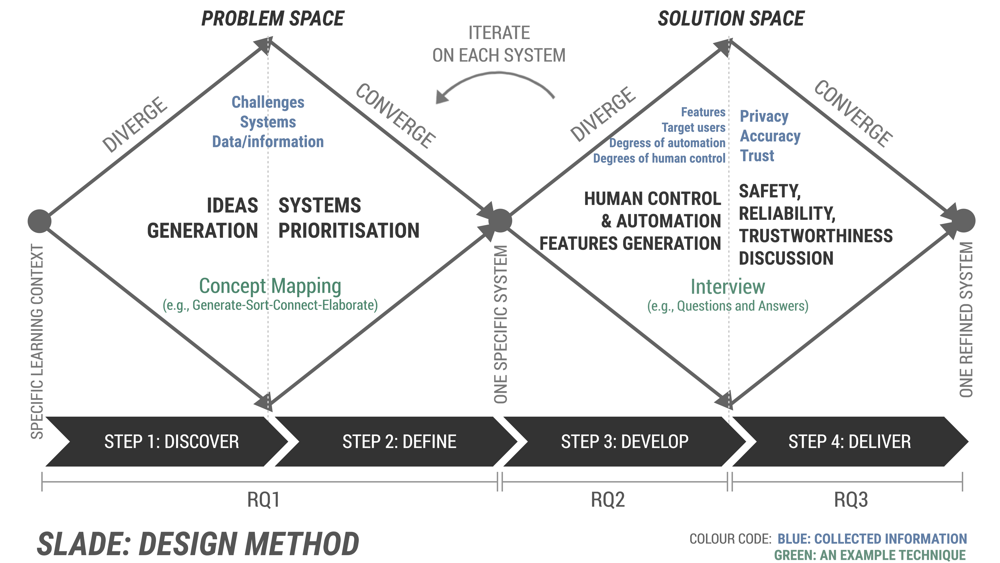

Learning Analytics (LA) systems have been gaining popularity in recent years, with a growing interest in incorporating stakeholder perspectives. However, many LA systems still lean towards a technology-centric approach, potentially overlooking human values and the necessity of human oversight in automation. To address this issue, we proposed a new method for designing human-centred LA systems called SLADE.

> Fig 1. SLADE method, inspired by [Double Diamond design thinking](https://www.designcouncil.org.uk/our-resources/framework-for-innovation/).

SLADE is based on the foundations of Human-Centred Artificial Intelligence (HCAI) and aims to enable the ideation and identification safe, reliable, and trustworthy LA systems that balance both human control and computer automation in collaboration with educational stakeholders (i.e., students). The method involves four steps:

1. identifying challenges and corresponding LA systems (potential solutions)
2. prioritising these LA systems
3. ideating human control and automation features
4. refining features emphasising safety, reliability, and trustworthiness.

We applied SLADE in designing LA systems to support collaborative learning in a healthcare simulation. The method intended to help align authentic student challenges with LA systems, understand students' perspectives on personal agency and delegation to features to teachers, and foster discussions about the safety, reliability, and trustworthiness of LA systems.

The paper has been accepted for full paper at LAK '24 in Kyoto, Japan, aligning with the conference theme of "Learning Analytics in the Age of Artificial Intelligence." It presents a practical method for researchers and designers to create features in LA systems that are safe, reliable, and trustworthy while considering students' agency and their voices in light of increasing AI automation.

The paper also highlights future directions, recommending the application of SLADE in other contexts and involving other critical educational and technical stakeholders, such as educators, LA designers, and AI developers. It suggests considering other factors, such as pedagogical value and feasibility of the system in practice, to support the learning process. The researchers plan to expand SLADE by including teachers and learning designers, gaining practical perspectives in teaching and learning.

If you are a researcher or designer passionate about human-centred learning analytics, we invite you to explore and expand upon the SLADE method to further advance the development of LA systems that prioritise these values (safety, reliability, and trustworthiness) and stakeholder involvement.

<object data="/pdfs/lak24-slade.pdf" type="application/pdf" width="100%" height="800px">
    <embed src="/pdfs/lak24-slade.pdf">
        
This browser does not support PDFs. Please download the PDF to view it: <a href="/pdfs/lak24-slade.pdf">Download PDF</a>.

    </embed>
</object>

Full-text view is also available
<a href="/pdfs/lak24-slade.pdf"> here</a>.
To reference it, please copy text below:

> Riordan Alfredo, Vanessa Echeverria, Yueqiao Jin, Zachari Swiecki, Dragan Gašević, and Roberto Martinez-Maldonado. 2024. SLADE: A Method for Designing Human-Centred Learning Analytics Systems. In The 14th Learning Analytics and Knowledge Conference (LAK ’24), March 18–22, 2024, Kyoto, Japan. ACM, New York, NY, USA, 16 pages. https://doi.org/10.1145/3636555.3636847
