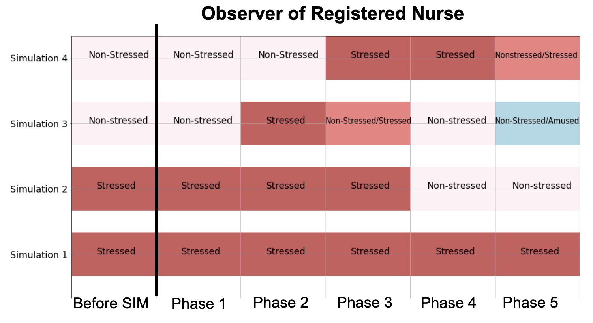
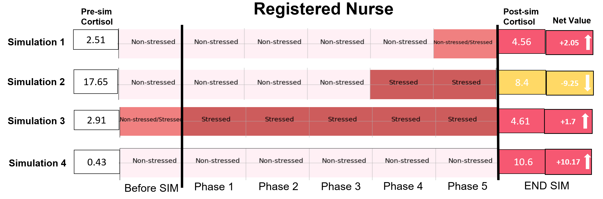

> Fig 1. A stress-inducing de-escalation simulation scenario. A team of undergraduate students, enacting the roles of registered/student nurses, patient’s family members and observers (not shown in the figure) all wearing Empatica E4 physiological wristbands.

In recent years, there has been a growing interest in creating multimodal learning analytics (LA) systems that automatically analyse
students’ states that are hard to see with the "naked eye", such as cognitive load and stress levels, but that can considerably shape their
learning experience. A rich body of research has focused on detecting such aspects by capturing bodily signals from students using
wearables and computer vision. Yet, little work has aimed at designing end-user interfaces that visualise physiological data to support
tasks deliberately designed for students to learn from stressful situations.

## What is this paper about?

This paper addresses this gap by designing a stress analytics dashboard (`StressViz`) that encodes students’ physiological data into stress levels during different phases of an authentic team simulation in the context of nursing education. We conducted a qualitative study with teachers to understand: (i) how they made sense of the stress analytics dashboard; (ii) the extent to which they trusted the dashboard in relation to students’ cortisol data; (iii) the potential adoption of this tool to communicate insights and aid teaching practices.

> Fig 2. An example of StressViz of nursing students who have 'Observer of Registered Nurse' role across 4 simulations. Blocks represent the majority of the labelled segments encountered in each phase for each student by using a multimodal stress data modelling (i.e., Random Forest for classification).

> Fig 3. StressViz for all students who played the role of ‘Registered Nurse‘ (RN) across simulations with cortisol data shown at the end of the timeline. Red and yellow blocks and an upward/downward arrow represent an increase or decrease in cortisol, respectively.

## Conclusion

Very few studies have addressed the challenge of visualising data to support reflection on students’ stress. This paper presented the **StressViz dashboard** that decodes students’ physiological data into stress labels for different phases of simulation in an authentic nursing teamwork context; and a qualitative study with teachers that sparked ideas about the potential of visualising stress as well as current limitations in the validity of stress detection, ethical concerns and potential misuses of such interfaces. We anticipate that this paper can serve as an inspiration for conducting further research in the development of stress visualisation tools to support stress-inducing learning situations.

<object data="/pdfs/lak23-stressviz.pdf" type="application/pdf" width="100%" height="800px">
    <embed src="/pdfs/lak23-stressviz.pdf">
        
This browser does not support PDFs. Please download the PDF to view it: <a href="/pdfs/lak23-stressviz.pdf">Download PDF</a>.

    </embed>
</object>

Full-text view is also available
<a href="/pdfs/lak23-stressviz.pdf"> here </a>.
To reference it, please copy text below:

> Riordan Dervin Alfredo, Lanbing Nie, Paul Kennedy, Tamara Power, Carolyn Hayes, Hui Chen, Carolyn McGregor, Zachari Swiecki,Dragan Gašević, and Roberto Martinez-Maldonado. 2023. "That Student Should be a Lion Tamer!" StressViz: Designing a Stress Analytics Dashboard for Teachers. In LAK23: 13th International Learning Analytics and Knowledge Conference (LAK 2023), March 13–17,2023, Arlington, TX, USA. ACM, New York, NY, USA, 16 pages. https://doi.org/10.1145/3576050.3576058
