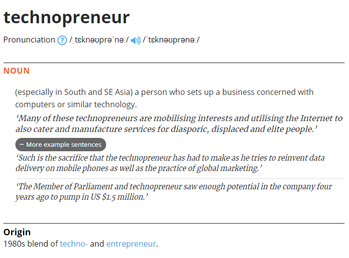

# Dear readers,

Hello, and welcome to my space! First of all, I want to say thank you for visiting this humble journal/blog :). This space is like a diary to express my thoughts, ideas, and other random stuffs about my journey to be one of the technology lead in ICT. First of all, let me introduce myself :)

My name is **Riordan**, people usually call me Rio (yep, like that bird, or a city in Brazil, Ha!). As I am writing this article, I live in Melbourne, Australia. I am a teaching associate of software engineering units. I am also working on a software project, while studying Management in parallel.

I came from a small city in Indonesia, Malang (if you understand Bahasa Indonesia / Malay, it means `poor`, `unfortunate`, or `hapless`). Despite its unique name, it is a great city! Warm-hearted people, nice scenery, and foremost, the food! The food is very delicious, tasty, and cheap! Wow, I miss them so much...

Uhm, I think the introduction might have gone too far. Anyway, you can read more about me in [here](https://rioalfredo.com/about-me). So, let's talk more about this blog.

# Technopreneur

This blog covers the combination of `business`, `ICT-software`, and `learning` domain. I believe those topics are mandatory and well understood to be a successful `technopreneur`. So, what is the meaning of this word?

As shown in the [picture](https://www.lexico.com/definition/technopreneur) above, the main purpose of this blog is to compile and publicly share the `technopreneruship` knowledge, so that we can learn how to be one of them. To be honest, I am still learning and I will keep learning about it, even from you, my reader!

Furthermore, I also love to discuss about `pseudoscience` topics, especially about psychology. It includes western and chinese astrology, 16 personalities test, enneagram, DiSC, and other psychology tests. I do not use them for fortune telling. Instead, I apply this knowledge to gain understanding about interlocutors for an effective communication.

# 5 reasons to start this blog

Now, here are my top 5 reasons (without order) why do I start this blog.

## 1. Owning a digital asset

I was convinced that blogging is a great digital asset. Most people use other platforms like YouTube, Instagram, etc. They are great places to start because easy to set up, mature, and author can gain exposure easily (through recommendation system). However, these platforms are not entirely owned by these content creators as their contents are stored by providers. Basically, they belong to those organisations. So, in my opinion, the ownership is unclear to me.

I developed this blog as my own business asset and for ownership purposes. I will use those platforms (YouTube, Instagram, Medium, Dev.to, etc.), but my intention is solely for marketing purposes. For a simple example, promoting this website. I believe that by doing so, I can have leads and hopefully I can get opportunities to monetise as the side income.

## 2. Grow my personal brand

By writing blog, it will validate my expertise. I can share my past and current projects, software engineering knowledge, business ideas, etc. I also confident that I can do networking building rapport and engagement like this article. Further advantage is I can stand out from the crowd and show my capabilities to the world.

## 3. Improve my communication skills (writing)

This writing helps me to organise my chaotic thoughts and improve my communication skills. Sometimes, my speech is unclear, too complex, and easyily skipping the context because I cannot say it. By writing them down, I can calm them down, and see whether what I try to express is clear enough and effective. Also, it also improves English language skills (yep, English is my third language).

## 4. Learn together with like-minded people

- Transition from business to IT and the other way around
- Help people to learn about programming and software engineering knowledge better.
- Open discussion about leadership and management in business

## 5. Practice discipline

- Sun Tzu said about iron discipline.
- Setting up schedule to write and publish

> I hope that this blog can facilitate the discussion and useful for you!

Thank you for reading, and see you next time :)
