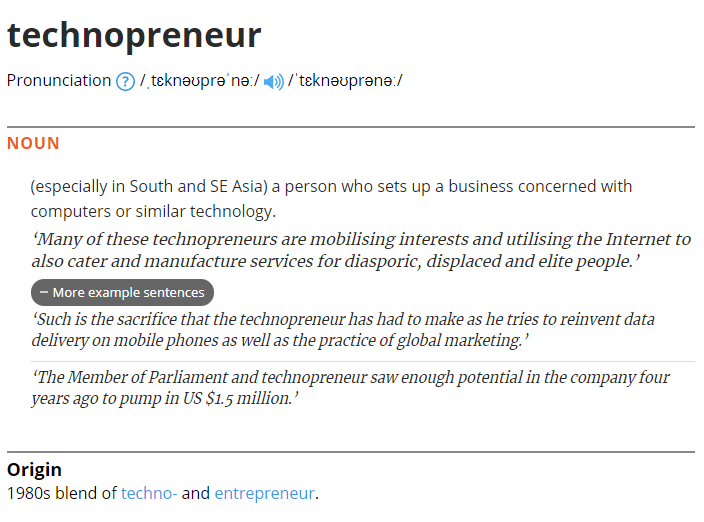

# Dear readers,

Hello, and welcome! First of all, I want to say thank you for visiting this humble journal/blog 😄. This article is the first article in this blog as the introduction about this blog. It includes the purpose of this blog, target readers, how do I present it, etc. This journal is intended as a diary to express my thoughts, ideas, and other random stuffs about my journey to be one of the technology leaders. Without further ado, let's talk about it.

# What is Technopreneurship?

This blog covers the combination of `business`, `ICT-software`, and `learning` area. I believe those topics are the best categorisation to describe `technopreneurship`. So, what is the meaning of this word?

As shown in the [picture](https://www.lexico.com/definition/technopreneur) above, it is obvious that technopreneur is formed from the combination of technology and business, but why do I include learning topic? In my opinion, effective learning is necessary to keep up with the speed of tehcnological advancement is tremendous. Above all, we are dealing excessive information that need to be filtered out every day. Learning is the support topic to help you advance and apply it immediately with the other topics.

Furthermore, I also love to discuss about other topics, such as `game`, `psychology`, and `pseudoscience`. It includes western and chinese astrology, 16 personalities test, enneagram, DiSC, etc. About astrology, I do not use them for fortune telling. Instead, I apply them to gain understanding about interlocutors for an effective communication. I also use them just for fun and easy-to-digest conversation.

The main purpose of this journal is to compile and publicly share `technopreneruship` knowledge. By excelling these three topics (business, IT, and learning), I believe the one can be a successful `technopreneur`. To be honest, I am still learning and I will keep learning about it, even from you, my readers! So, please don't hesitate to comment in my post 😉.

# 5 reasons to start this journal

Now, here are my top 5 reasons (without order) why do I start this journal.

## 1. Assist smooth career transition in IT-Business

I realise that many people want to transition from technical to business career, and the other way around. For example, it happens to people who study MBA (Master of Business Administration) after finishing an IT degree or people who already got a business degree (or doing a lot of business hustle) and want to study Master of IT or Data Science. Maybe, some people are just curious about the other side. `If any of these is you, congratulations! You are at the right place!`. The purpose of journal is aligned with one of my personal goals, which is assisting smooth transition and be successful in the career that they choose. I hope that this journal can help people to learn about programming and software engineering knowledge better. I will also open an opportunity to discuss about leadership and management in business. By having an open discussion, we can learn together hopefully, achieving our goals 😄!

## 2. Own a digital business asset

I am a strong believer that blogging is a great digital asset. Most people use other platforms like YouTube, Instagram, etc., as their digital business asset. These platforms are great places to start because they are easy to set up, mature, and author can gain exposure easily (e.g. through recommendation system). However, these platforms are not entirely owned by those content creators as their contents are governed by providers. Basically, they belong to those organisations. So, in my opinion, the ownership is unclear.

I developed this journal as my own business asset and for ownership purposes. I will use those platforms (YouTube, Instagram, Medium, Dev.to, etc.), but my intention is solely for marketing purposes such as promoting this website. By doing so, it helps getting leads and open opportunities to monetise as the side income.

## 3. Grow personal brand

The first benefit is validating my expertise as `technopreneur` through my career as software engineer, software educator, and business owner. As a software engineer, I will share some small bits of interesting code/ideas from the past and current projects. It shows my abilities in software development and how do I solve technical problems. I will also open discussion about strategic management, leadership, and interesting business ideas in the business section. As an academic educator, I can share my understanding and perspective about software engineering knowledge, effective learning, and teaching. This information can demonstrate to my readers, future partners, and network that I am knowledgeable and skilled in these areas. Besides, I am confident with the developed personal brand and to show that I can stand out from the crowd. With strong personal brand, it opens up further opportunity for networking, building rapport, and engagement!

## 4. Improve communication skills (writing)

This writing helps me to organise my chaotic thoughts and improve my communication skills. Sometimes, my speech is unclear, too complex, and I can say something that is conflicting with what I have in my mind. By writing them down, I can see clearly what I'm trying to express is clear enough and easy to understand. Further obvious advantage is improving my English language skills (oh, English is my tertiary language), especially writing skill.

## 5. Practice discipline

> "Soldiers must be first treated in the first instance with humanity, but kept under control by means of iron discipline" — Sun Tzu, The Art of War

In my interpretation, iron discipline assure consistency. Many quotes, podcast, and motivational books cover about consistency as the key to be successful. So, I believe that having an iron discipline, it will help me to be consistent in writing and publishing. How do I achieve this kind of discipline? I need strong motivation and flexible schedule. For motivation, I always refer to `why do I do this?`. Asking my self with this **WHY** question, helps me to gain motivation to work and get things done. As I want to achieve flexible schedule, I set up a deadline for writing and publishing articles weekly by planning it a week ahead. I never plan beyond than a week because rigid schedule doesn't work most of the time.

## Phew, it's pretty long for an introduction 😅.

I hope that this journal/blog can be useful for you! Thank you for reading and see you next time 🦥!

> Most of images are retrieved from [pixabay](https://pixabay.com/)
